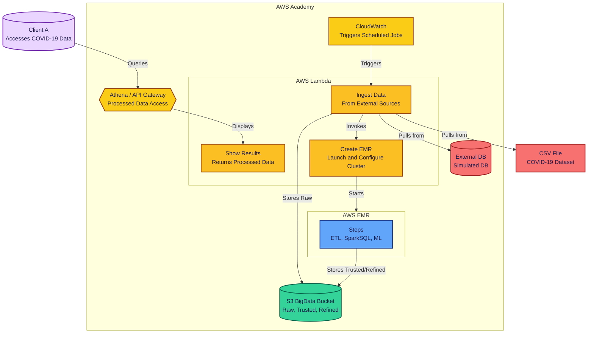

# Project 3 – Batch Architecture for Big Data (ST0263 - EAFIT)

## 🧠 General Overview
This project showcases a complete batch data processing pipeline using AWS services. It automates the capture, ingestion, transformation, analysis, and visualization of COVID-19 data.

---

## 🏗️ Architecture Diagram



---

## ✅ Task Checklist

### 📦 Initial Setup
- [X] Create an S3 bucket with zones: Raw, Trusted, and Refined.

### 🔽 Capture & Ingestion
- [X] Script to download COVID-19 data.
- [X] Set up PostgreSQL (RDS) and import CSV.
- [X] Extract data from DB into S3 Raw using Lambda.
- [X] Add duplicate check in Raw zone.

### ⚙️ ETL Processing
- [X] Clean and join data with PySpark.
- [X] Launch EMR via CLI or Lambda.
- [X] Define and run EMR steps.
- [X] Organize data into S3 Trusted zone.

### 📊 Advanced Analytics
- [X] Use SparkSQL for descriptive statistics.
- [X] Train models using SparkML.
- [X] Save analytics output in S3 Refined zone.
- [X] Link ETL and ML steps in EMR.

### 📈 Visualization & API Access
- [X] Set up Athena for querying S3.
- [X] Create Lambda-backed API Gateway.
- [X] Test API with Postman.

### 🔁 Automation & Monitoring
- [X] Use AWS Step Functions to orchestrate.
- [X] Schedule runs with EventBridge.
- [X] Monitor using CloudWatch.
- [X] Build dashboard for observability.

---

## 🔧 Setup Instructions

### :floppy_disk: S3 Bucket Configuration
Create a bucket in S3 with the name you want `YOUR_BUCKET_NAME` and the following structure

1. Go to the S3 console.
2. Click on "Create bucket".
3. Enter the bucket name `YOUR_BUCKET_NAME`.
4. Choose the region (e.g., `us-east-1`).
5. Uncheck "Block all public access".
6. Click on "Create bucket".
7. Select the bucket you just created.
8. Click on "Permissions" tab.
9. On the "Bucket policy" section, click on "Edit".
10. Paste the following policy, replacing `YOUR_BUCKET_NAME` with your bucket name:

```json
{
	"Version": "2012-10-17",
	"Statement": [
		{
			"Sid": "AllowAllLambdaPutObject",
			"Effect": "Allow",
			"Principal": "*",
			"Action": "s3:PutObject",
			"Resource": "arn:aws:s3:::YOUR_BUCKET_NAME/*"
		},
		{
			"Sid": "AllowDeleteObjects",
			"Effect": "Allow",
			"Principal": "*",
			"Action": [
				"s3:DeleteObject",
				"s3:AbortMultipartUpload"
			],
			"Resource": "arn:aws:s3:::YOUR_BUCKET_NAME/*"
		},
		{
			"Sid": "AllowPublicRead",
			"Effect": "Allow",
			"Principal": "*",
			"Action": "s3:GetObject",
			"Resource": "arn:aws:s3:::YOUR_BUCKET_NAME/*"
		},
		{
			"Sid": "AllowListBucket",
			"Effect": "Allow",
			"Principal": "*",
			"Action": "s3:ListBucket",
			"Resource": "arn:aws:s3:::YOUR_BUCKET_NAME"
		}
	]
}
```

With this, your S3 bucket will have public access and your lambda function will be able to upload files to it.


### PostgreSQL RDS Setup
1. Create the RDS instance with PostgreSQL.
2. Create a database named `covid_data`.
3. Import the CSV file into the database at [`country_data.csv`](./data/country_data.csv).

### CloudWatch EventBridge

1. Go to the Amazon EventBridge console.
2. Click on the "Programmatic access" tab.
3. Click on "Create programmatic access".
  - Select "Recurring schedule".
  - Set the range to 1 hour.
  - Select the lambda function you created in the previous step.
  - Use the labrole role.
4. Click on "Create rule".

### Lambda Ingestion
1. Create a Lambda function with the following configuration:
   - Runtime: Python 3.12.0
   - Role: LabRole.
   - Copy the content of the [`data_insertion.py`](./scripts/data_insertion.py) file into the Lambda function.
   - Modify the `BUCKET_NAME` and `LAMBDA_FUNCTION_NAME` values as your bucket name and the name of your Lambda function that creates the EMR cluster.
2. Set up the layer with the following configuration:
   - Runtime: Python 3.12.0
   - Layer name: `PandasLayer`.
   - Upload the zip file from [`ingestion_layer.zip`](./layers/pandas.zip) to the layer.
   - Layer name: `RequestsLayer`.
   - Upload the zip file from [`requests_layer.zip`](./layers/requests.zip) to the layer.
   - Layer name: `Psycopg2Layer`.
   - Upload the zip file from [`psycopg2_layer.zip`](./layers/psycopg2.zip) to the layer.
3. Add the layers to the Lambda function.
4. Deploy the Lambda function.
5. Go to settings and set the timeout to 45 seconds.

### EMR Lambda Setup
1. Create a Lambda function with the following configuration:
   - Runtime: Python 3.12.0
   - Role: LabRole.
   - Copy the content of the [`emr_creation.py`](./scripts/emr_creation.py) file into the Lambda function.
   - Modify the `bucket_name` variable to your bucket name.
   - Modify the json value for `ServiceRole` and `AutoScalingRole` matching the IAM roles you created of your account.

### EMR Scripts Upload
1. Create a folder in the S3 bucket with the name `scripts`.
2. Upload the following files to the `scripts` folder:
   - [`dependencies.sh`](./scripts/dependencies.sh) (This will be used as a Bootstrap Action)
   - [`Analytics-EMR.py`](./scripts/Analytics-EMR.py) (This will be used as a EMR step)
   - [`ETL.py`](./scripts/ETL.py). Modify the `BUCKET_NAME` variable to your bucket name. (This will be used as a EMR step)

### Athena Setup
1. Go to the Amazon Athena console.
2. Init the editor with `Trino SQL`.
3. Create the folder `athena_results/` in the S3 bucket. 
4. Go to the settings and set the `Query result location` to `s3://YOUR_BUCKET_NAME/athena_results/`.
5. Execute the scripts in the following order, replacing `YOUR-S3-BUCKET` with your bucket name:
   - [`create_db.sql`](./athena/create_db.sql)
   - [`create_cluster_summary_table.sql`](./athena/create_cluster_summary_table.sql)
   - [`create_clusters_table.sql`](./athena/create_clusters_table.sql)
   - [`create_continent_stats_table.sql`](./athena/create_continent_stats_table.sql)
   - [`create_correlation_analysis_table.sql`](./athena/create_correlation_analysis_table.sql)
   - [`create_hdi_analysis_table.sql`](./athena/create_hdi_analysis_table.sql)
   - [`create_numeric_summary_table.sql`](./athena/create_numeric_summary_table.sql)
   - [`create_top_countries_table.sql`](./athena/create_top_countries_table.sql)

### Lambda for Results
1. Create a Lambda function with the following configuration:
   - Runtime: Python 3.12.0
   - Role: LabRole.
   - Copy the content of the [`show_results.py`](./scripts/show_results.py) file into the Lambda function.
   - Modify the `BUCKET_NAME` variable to your bucket name.

### API Gateway Integration
1. Go to the Amazon API Gateway console.
2. Create a new API.
3. Select "HTTP API".
4. Add the Show Results Lambda function as the integration.
5. Create a new route with the following configuration:
   - Method: Post
   - Resource path: /showResults
6. Go to the "Stages" tab and create a new stage.
7. Deploy the API to the new stage.
8. Copy the endpoint URL and save it for later use.
9. Open in Postman and create a new request.
10. Set the method to POST and the URL to the endpoint you copied with the `/showResults` path.
11. In the body, select "raw" and set the type to JSON.
12. Paste the following JSON:
```json
{
    "table": "continent_stats"
}
```
You should see a response with the data from the table you selected.
```
[
    {
        "continent": "Africa",
        "countries": "57"
    },
    {
        "continent": "Europe",
        "countries": "51"
    },
    {
        "continent": "Asia",
        "countries": "48"
    },
    {
        "continent": "North America",
        "countries": "41"
    },
    {
        "continent": "Oceania",
        "countries": "24"
    },
    {
        "continent": "South America",
        "countries": "14"
    }
]
```

---
# :hourglass: Detailed Information

## EMR clouster creation

The EMR cluster is created using [`emr_creation.py`](./scripts/emr_creation.py) script. This script is executed by an AWS Lambda function, which is triggered automatically every hour in our specific setup. Within the script, all configuration details of the cluster are defined. This is done by using the EMR client provided by Python’s boto3 library. One of the most important parameters in this process specifies the configuration, number, and type of Amazon EC2 instances that will make up the cluster.
``` python
Instances={
            'InstanceGroups': [
                {
                    'Name': 'Core',
                    'Market': 'ON_DEMAND',
                    'InstanceRole': 'CORE',
                    'InstanceType': 'm5.xlarge',
                    'InstanceCount': 2,
                    'EbsConfiguration': {
                        'EbsBlockDeviceConfigs': [
                            {
                                'VolumeSpecification': {
                                    'VolumeType': 'gp2',
                                    'SizeInGB': 32
                                },
                                'VolumesPerInstance': 2
                            }
                        ]
                    }
                },
                {
                    'Name': 'Task - 1',
                    'Market': 'ON_DEMAND',
                    'InstanceRole': 'TASK',
                    'InstanceType': 'm5.xlarge',
                    'InstanceCount': 1,
                    'EbsConfiguration': {
                        'EbsBlockDeviceConfigs': [
                            {
                                'VolumeSpecification': {
                                    'VolumeType': 'gp2',
                                    'SizeInGB': 32
                                },
                                'VolumesPerInstance': 2
                            }
                        ]
                    }
                },
                {
                    'Name': 'Primary',
                    'Market': 'ON_DEMAND',
                    'InstanceRole': 'MASTER',
                    'InstanceType': 'm5.xlarge',
                    'InstanceCount': 1,
                    'EbsConfiguration': {
                        'EbsBlockDeviceConfigs': [
                            {
                                'VolumeSpecification': {
                                    'VolumeType': 'gp2',
                                    'SizeInGB': 32
                                },
                                'VolumesPerInstance': 2
                            }
                        ]
                    }
                }
            ],
            'Ec2KeyName': 'vockey',
            'KeepJobFlowAliveWhenNoSteps': False,
            'TerminationProtected': False,
            'EmrManagedMasterSecurityGroup': 'sg-02a314a7008e9e131',
            'EmrManagedSlaveSecurityGroup': 'sg-059776e19481dae34',
            'InstanceFleets': [],
            'Ec2SubnetIds': ['subnet-00b2bd144141a60bc']
        },
        EbsRootVolumeSize=32,
        VisibleToAllUsers=True,
        JobFlowRole='EMR_EC2_DefaultRole',
        ServiceRole='arn:aws:iam::296269837706:role/EMR_DefaultRole',
        AutoScalingRole='arn:aws:iam::296269837706:role/LabRole',
        ScaleDownBehavior='TERMINATE_AT_TASK_COMPLETION',
        BootstrapActions=[
            {
                'Name': 'Dependencies',
                'ScriptBootstrapAction': {
                    'Path': f's3://{bucket_name}/scripts/dependencies.sh',
                    'Args': []
                }
            },
        ]
```
Other fundamental parameters for achieving the project’s objectives are `BootstrapActions` and Steps. These define the actions to be executed during the cluster creation process—specifically, just before the installation of the selected applications `(BootstrapActions)`. In our case, the bootstrap actions are used to install the necessary dependencies for the correct execution of the [`Analytics-EMR.py`](./scripts/Analytics-EMR.py) script.

The `Steps`, on the other hand, allow us to simulate big data processing on an `EMR` cluster using data stored in S3. In our implementation, this involves simulating an `ETL` process over raw S3 data with the [`ETL.py`](./scripts/ETL.py) script, which saves the data in the `Trusted` zone. This script transforms the data into a suitable format for analytics and machine learning tasks, which are then performed using the [`Analytics-EMR.py`](./scripts/Analytics-EMR.py) script, finally saves the data in the `Refined` zone.
``` python
BootstrapActions=[
            {
                'Name': 'Dependencies',
                'ScriptBootstrapAction': {
                    'Path': f's3://{bucket_name}/scripts/dependencies.sh',
                    'Args': []
                }
            },
        ],
        Steps=[
            {
                'Name': 'ETL',
                'ActionOnFailure': 'TERMINATE_CLUSTER',
                'HadoopJarStep': {
                    'Jar': 'command-runner.jar',
                    'Args': [
                        'spark-submit',
                        '--deploy-mode', 'cluster',
                        f's3://{bucket_name}/scripts/ETL.py',
                    ]
                }
            },
            {
                'Name': 'Analytics',
                'ActionOnFailure': 'TERMINATE_CLUSTER',
                'HadoopJarStep': {
                    'Jar': 'command-runner.jar',
                    'Args': [
                        'spark-submit',
                        '--deploy-mode', 'client',
                        f's3://{bucket_name}/scripts/Analytics-EMR.py',
                        '--data_source', f's3://{bucket_name}/trusted/joined/',
                        '--output_uri', f's3://{bucket_name}/refined/'
                    ]
                }
            }
        ]
```

## Data analysis and machine learning
Data processing (achived using the script [`Analytics-EMR.py`](./scripts/Analytics-EMR.py)) is performed with a Spark application that conducts exploratory data analysis and clustering on COVID-related information stored in Parquet format. The main actions include:
- Descriptive statistics:
  - The number of registered countries per continent is calculated, provided that the `continent` field is not null.
  - Statistics such as average and maximum values are calculated for columns like `total_cases`, `total_deaths`, `population`, and `cases_per_thousand`.
  - Countries with available data in total_cases are filtered and sorted in descending order, selecting the top `10` with the most confirmed cases. Additional columns such as `continent`, `population`, and `cases_per_thousand` are also included.
- SparkSQL usage:
  - `Correlation analysis`: An SQL query is executed to calculate the correlation between indicators such as `human_development_index`, `gdp_per_capita`, and `population_density` with the `cases_per_thousand` metric, grouped by continent. The average of the indicators and the number of countries analyzed per group are also calculated.
  - Countries are grouped according to their human development level `(HDI)` into categories: Very High `(≥ 0.8)`, High `(0.7–0.8)`, Medium `(0.55–0.7)`, and Low `(< 0.55)`. For each group, the number of countries, average cases per thousand inhabitants `(cases_per_thousand)`, and deaths per million `(total_deaths_per_million)` are calculated.
    ```python
    correlation_analysis = spark.sql("""
                    SELECT 
                        continent,
                        CORR(human_development_index, cases_per_thousand) as hdi_cases_correlation,
                        CORR(gdp_per_capita, cases_per_thousand) as gdp_cases_correlation,
                        CORR(population_density, cases_per_thousand) as density_cases_correlation,
                        COUNT(*) as country_count,
                        AVG(human_development_index) as avg_hdi,
                        AVG(gdp_per_capita) as avg_gdp
                    FROM covid_data 
                    WHERE human_development_index IS NOT NULL 
                        AND cases_per_thousand IS NOT NULL
                        AND gdp_per_capita IS NOT NULL
                        AND population_density IS NOT NULL
                    GROUP BY continent
                    ORDER BY hdi_cases_correlation DESC NULLS LAST
                """)
    ```
- SparkML usage:
  - In order to group countries according to similar characteristics, we use a `K-Means` algorithm. We try to find patterns among countries, for example, countries with similar socioeconomic conditions and similar levels of `COVID` cases.
  - A Machine Learning pipeline is built that includes feature assembly `(VectorAssembler)`, scaling `(StandardScaler)`, and clustering into 4 clusters.
    ```python
    features = ["human_development_index", "gdp_per_capita", "population_density"]
                    
                    assembler = VectorAssembler(inputCols=features, outputCol="features_raw")
                    scaler = StandardScaler(inputCol="features_raw", outputCol="features_scaled")
                    kmeans = KMeans(featuresCol="features_scaled", predictionCol="cluster", k=4, seed=42)
                    
                    pipeline = Pipeline(stages=[assembler, scaler, kmeans])
                    
                    print("Entrenando modelo de clustering...")
                    model = pipeline.fit(ml_data)
                    clustered_data = model.transform(ml_data)
                    
                    cluster_summary = clustered_data.groupBy("cluster") \
                        .agg(
                            count("location").alias("countries"),
                            avg("human_development_index").alias("avg_hdi"),
                            avg("gdp_per_capita").alias("avg_gdp"),
                            avg("population_density").alias("avg_density"),
                            avg("cases_per_thousand").alias("avg_cases_per_thousand")
                        ).orderBy("cluster")
    ```

---

## 👥 Authors
- **Juan Felipe Restrepo Buitrago**
- **Kevin Quiroz González**
- **Julian Estiven Valencia Bolaños**
- **Julian Agudelo Cifuentes**

**Course:** ST0263 – Special Topics in Telematics  
**University:** EAFIT  
**Term:** 2025-1
