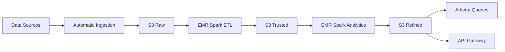

# Project 3 - Batch Architecture for Big Data

## General Description
This project implements a big data example that automates the complete process of capturing, ingesting, processing, and outputting actionable data using AWS services.

## Architecture


## Components

### 1. Data Sources
- 

### 2. Data Ingestion
- 

### 3. ETL Processing
- 

### 4. Analysis and Analytics
- 

### 5. Data Access
- 

## Repository Structure

```
/
├── docs/                 # Additional documentation
├── scripts/
│   ├── ingestion/        # Data ingestion scripts
│   ├── etl/              # ETL transformation scripts
│   ├── analytics/        # Analysis and ML scripts
│   └── deployment/       # Deployment scripts
├── infrastructure/       # Infrastructure definitions (CloudFormation, etc.)
├── api/                  # API Gateway code
├── notebooks/            # Jupyter notebooks for examples
├── tests/                # Automated tests
└── README.md
```

## Prerequisites
- AWS Academy account
- Configured AWS CLI
- Python 3.8+
- Apache Spark
- Git

## Initial Setup

### AWS Configuration
1. Create IAM roles with necessary permissions
2. Configure S3 buckets for Raw, Trusted, and Refined zones
3. Set up RDS for relational database

### Local Installation
```bash
# Example
# Clone repository
git clone https://github.com/username/project3-big-data.git
cd project3-big-data


python -m venv venv
source venv/bin/activate  # On Windows: venv\Scripts\activate
pip install -r requirements.txt
```

## Implementation

### 1. Data Ingestion
```bash
# Configure Lambda function for ingestion
```

### 2. ETL Processing
```bash
# Deploy EMR cluster and configure Steps
```

### 3. Data Analysis
```bash
# Run analysis on EMR cluster
```

### 4. Query Configuration
```bash
# Configure Athena

# Deploy API Gateway
```

## Usage

### Athena Queries
1. ...

### API Queries
```bash
# Example of API query
```

## Authors
