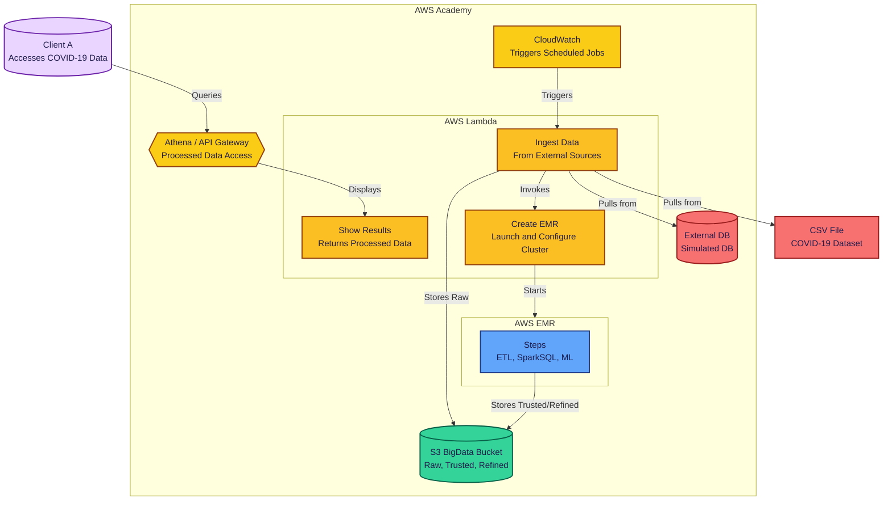

# Project 3 – Batch Architecture for Big Data (ST0263 - EAFIT)

## 🧠 General Overview
This project showcases a complete batch data processing pipeline using AWS services. It automates the capture, ingestion, transformation, analysis, and visualization of COVID-19 data.

---

## 🏗️ Architecture Diagram

---

## ✅ Task Checklist

### 📦 Initial Setup
- [ ] Create an S3 bucket with zones: Raw, Trusted, and Refined.

### 🔽 Capture & Ingestion
- [ ] Script to download COVID-19 data.
- [ ] Set up PostgreSQL (RDS) and import CSV.
- [ ] Extract data from DB into S3 Raw using Lambda.
- [ ] Add duplicate check in Raw zone.

### ⚙️ ETL Processing
- [ ] Clean and join data with PySpark.
- [ ] Launch EMR via CLI or Lambda.
- [ ] Define and run EMR steps.
- [ ] Organize data into S3 Trusted zone.

### 📊 Advanced Analytics
- [ ] Use SparkSQL for descriptive statistics.
- [ ] Train models using SparkML.
- [ ] Save analytics output in S3 Refined zone.
- [ ] Link ETL and ML steps in EMR.

### 📈 Visualization & API Access
- [ ] Set up Athena for querying S3.
- [ ] Create Lambda-backed API Gateway.
- [ ] Test API with Postman.

### 🔁 Automation & Monitoring
- [ ] Use AWS Step Functions to orchestrate.
- [ ] Schedule runs with EventBridge.
- [ ] Monitor using CloudWatch.
- [ ] Build dashboard for observability.

---

## 🔧 Setup Instructions

### S3 Bucket Configuration
Follow instructions to create the S3 bucket and attach the required bucket policy (see original version).

### PostgreSQL RDS Setup
1. Create DB named `covid_data`.
2. Upload `country_data.csv` into the DB.

### Lambda Ingestion
Set up a Lambda function with the code in `scripts/data_insertion.py`, update environment variables, attach the layer (`ingestion_layer.zip`) and set a CloudWatch trigger.

### EMR Lambda Setup
Configure a Lambda using `scripts/emr_creation.py`, adjust IAM roles and bucket names.

### EMR Scripts Upload
Create a `scripts/` folder in S3. Upload:
- `ETL.py` (edit bucket name)
- `dependencies.sh`
- `Analytics-EMR.py`

### Athena Setup
Create database and tables using provided SQL scripts. Set `athena_results/` as query output.

### Lambda for Results
Create `show_results.py` Lambda to fetch Athena results based on table names.

### API Gateway Integration
Expose the `showResults` Lambda via HTTP POST route `/showResults`. Test using Postman.

---

## 👥 Authors
- **Juan Felipe Restrepo Buitrago**
- **Kevin Quiroz González**
- **Julian Estiven Valencia Bolaños**
- **Julian Agudelo Cifuentes**

**Course:** ST0263 – Special Topics in Telematics  
**University:** EAFIT  
**Term:** 2025-1
