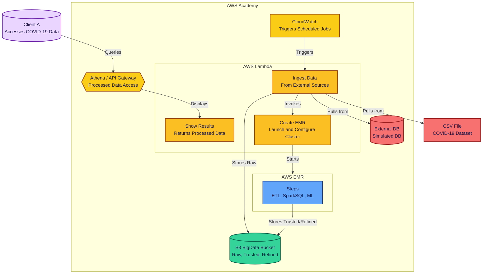

# Project 3 – Batch Architecture for Big Data (ST0263 - EAFIT)

## 🧠 General Overview
This project showcases a complete batch data processing pipeline using AWS services. It automates the capture, ingestion, transformation, analysis, and visualization of COVID-19 data.

---

## 🏗️ Architecture Diagram



---

## ✅ Task Checklist

### 📦 Initial Setup
- [X] Create an S3 bucket with zones: Raw, Trusted, and Refined.

### 🔽 Capture & Ingestion
- [X] Script to download COVID-19 data.
- [X] Set up PostgreSQL (RDS) and import CSV.
- [X] Extract data from DB into S3 Raw using Lambda.
- [X] Add duplicate check in Raw zone.

### ⚙️ ETL Processing
- [X] Clean and join data with PySpark.
- [X] Launch EMR via CLI or Lambda.
- [X] Define and run EMR steps.
- [X] Organize data into S3 Trusted zone.

### 📊 Advanced Analytics
- [X] Use SparkSQL for descriptive statistics.
- [X] Train models using SparkML.
- [X] Save analytics output in S3 Refined zone.
- [X] Link ETL and ML steps in EMR.

### 📈 Visualization & API Access
- [ ] Set up Athena for querying S3.
- [ ] Create Lambda-backed API Gateway.
- [ ] Test API with Postman.

### 🔁 Automation & Monitoring
- [ ] Use AWS Step Functions to orchestrate.
- [ ] Schedule runs with EventBridge.
- [ ] Monitor using CloudWatch.
- [ ] Build dashboard for observability.

---

## 🔧 Setup Instructions

### :floppy_disk: S3 Bucket Configuration
Create a bucket in S3 with the name you want `YOUR_BUCKET_NAME` and the following structure

1. Go to the S3 console.
2. Click on "Create bucket".
3. Enter the bucket name `YOUR_BUCKET_NAME`.
4. Choose the region (e.g., `us-east-1`).
5. Uncheck "Block all public access".
6. Click on "Create bucket".
7. Select the bucket you just created.
8. Click on "Permissions" tab.
9. On the "Bucket policy" section, click on "Edit".
10. Paste the following policy, replacing `YOUR_BUCKET_NAME` with your bucket name:

```json
{
	"Version": "2012-10-17",
	"Statement": [
		{
			"Sid": "AllowAllLambdaPutObject",
			"Effect": "Allow",
			"Principal": "*",
			"Action": "s3:PutObject",
			"Resource": "arn:aws:s3:::YOUR_BUCKET_NAME/*"
		},
		{
			"Sid": "AllowDeleteObjects",
			"Effect": "Allow",
			"Principal": "*",
			"Action": [
				"s3:DeleteObject",
				"s3:AbortMultipartUpload"
			],
			"Resource": "arn:aws:s3:::YOUR_BUCKET_NAME/*"
		},
		{
			"Sid": "AllowPublicRead",
			"Effect": "Allow",
			"Principal": "*",
			"Action": "s3:GetObject",
			"Resource": "arn:aws:s3:::YOUR_BUCKET_NAME/*"
		},
		{
			"Sid": "AllowListBucket",
			"Effect": "Allow",
			"Principal": "*",
			"Action": "s3:ListBucket",
			"Resource": "arn:aws:s3:::YOUR_BUCKET_NAME"
		}
	]
}
```

With this, your S3 bucket will have public access and your lambda function will be able to upload files to it.


### PostgreSQL RDS Setup
1. Create the RDS instance with PostgreSQL.
2. Create a database named `covid_data`.
3. Import the CSV file into the database at [`country_data.csv`](./data/country_data.csv).

### CloudWatch EventBridge

1. Go to the Amazon EventBridge console.
2. Click on the "Programmatic access" tab.
3. Click on "Create programmatic access".
  - Select "Recurring schedule".
  - Set the range to 1 hour.
  - Select the lambda function you created in the previous step.
  - Use the labrole role.
4. Click on "Create rule".

### Lambda Ingestion
1. Create a Lambda function with the following configuration:
   - Runtime: Python 3.12.0
   - Role: LabRole.
   - Copy the content of the [`data_insertion.py`](./scripts/data_insertion.py) file into the Lambda function.
   - Modify the `BUCKET_NAME` and `GLUE_WORKFLOW_NAME` values as your bucket name and the name of your Glue workflow.
2. Set up the layer with the following configuration:
   - Runtime: Python 3.12.0
   - Layer name: `PandasLayer`.
   - Upload the zip file from [`ingestion_layer.zip`](./layers/pandas.zip) to the layer.
   - Layer name: `RequestsLayer`.
   - Upload the zip file from [`requests_layer.zip`](./layers/requests.zip) to the layer.
   - Layer name: `Psycopg2Layer`.
   - Upload the zip file from [`psycopg2_layer.zip`](./layers/psycopg2.zip) to the layer.
3. Add the layers to the Lambda function.
4. Deploy the Lambda function.
5. Go to settings and set the timeout to 45 seconds.

### Glue Job Setup
1. Go to the AWS Glue console.
2. Click on "Jobs" in the left sidebar.
3. Click on "Add job".
4. Enter the following configuration:
   - Name: `project3-etl-job`.
   - IAM Role: `LabRole`.
   - Type: Spark.
   - Glue version: 4.0. - Supports spark 3.3, Scala 2, Python 3
   - Python version: 3.
   - Worker type: G.1X.
   - Number of workers: 3.
5. Add the code at [`ETL.py`](./scripts/ETL.py) to the job script.
6. Modify the `BUCKET_NAME` variables to your bucket name and the name of your Lambda function to create the EMR cluster.
7. Add a second job as Python shell with the following configuration:
   - Name: `project3-trigger-job`.
   - IAM Role: `LabRole`.
   - Type: Python shell.
   - Python version: 3.
8. Add the code at [`trigger.py`](./scripts/trigger.py) to the job script.
9. Modify the `LAMBDA_FUNCTION_NAME` variable to the name of your Lambda function that creates the EMR cluster.
10. Go to Workflows in the left sidebar.
11. Click on "Add workflow".
12. Enter the following configuration:
    - Name: `project3-workflow`.
    - IAM Role: `LabRole`.
13. Add an On-Demand trigger to the workflow.
14. Add the `project3-etl-job` job to the workflow.
15. Add an event trigger after the `project3-etl-job` job to trigger the `project3-trigger-job` job.

### EMR Lambda Setup
1. Create a Lambda function with the following configuration:
   - Runtime: Python 3.12.0
   - Role: LabRole.
   - Copy the content of the [`emr_creation.py`](./scripts/emr_creation.py) file into the Lambda function.
   - Modify the `bucket_name` variable to your bucket name.
   - Modify the json value for `ServiceRole` and `AutoScalingRole` matching the IAM roles you created of your account.

### EMR Scripts Upload
1. Create a folder in the S3 bucket with the name `scripts`.
2. Upload the following files to the `scripts` folder:
   - [`dependencies.sh`](./scripts/dependencies.sh)
   - [`Analytics-EMR.py`](./scripts/Analytics-EMR.py)

### Athena Setup
1. Go to the Amazon Athena console.
2. Init the editor with `Trino SQL`.
3. Create the folder `athena_results/` in the S3 bucket. 
4. Go to the settings and set the `Query result location` to `s3://YOUR_BUCKET_NAME/athena_results/`.
5. Execute the scripts in the following order, replacing `YOUR-S3-BUCKET` with your bucket name:
   - [`create_db.sql`](./athena/create_db.sql)
   - [`create_cluster_summary_table.sql`](./athena/create_cluster_summary_table.sql)
   - [`create_clusters_table.sql`](./athena/create_clusters_table.sql)
   - [`create_continent_stats_table.sql`](./athena/create_continent_stats_table.sql)
   - [`create_correlation_analysis_table.sql`](./athena/create_correlation_analysis_table.sql)
   - [`create_hdi_analysis_table.sql`](./athena/create_hdi_analysis_table.sql)
   - [`create_numeric_summary_table.sql`](./athena/create_numeric_summary_table.sql)
   - [`create_top_countries_table.sql`](./athena/create_top_countries_table.sql)

### Lambda for Results
1. Create a Lambda function with the following configuration:
   - Runtime: Python 3.12.0
   - Role: LabRole.
   - Copy the content of the [`show_results.py`](./scripts/show_results.py) file into the Lambda function.
   - Modify the `BUCKET_NAME` variable to your bucket name.

### API Gateway Integration
1. Go to the Amazon API Gateway console.
2. Create a new API.
3. Select "HTTP API".
4. Add the Show Results Lambda function as the integration.
5. Create a new route with the following configuration:
   - Method: Post
   - Resource path: /showResults
6. Go to the "Stages" tab and create a new stage.
7. Deploy the API to the new stage.
8. Copy the endpoint URL and save it for later use.
9. Open in Postman and create a new request.
10. Set the method to POST and the URL to the endpoint you copied with the `/showResults` path.
11. In the body, select "raw" and set the type to JSON.
12. Paste the following JSON:
```json
{
    "table": "continent_stats"
}
```
You should see a response with the data from the table you selected.
```
[
    {
        "continent": "Africa",
        "countries": "57"
    },
    {
        "continent": "Europe",
        "countries": "51"
    },
    {
        "continent": "Asia",
        "countries": "48"
    },
    {
        "continent": "North America",
        "countries": "41"
    },
    {
        "continent": "Oceania",
        "countries": "24"
    },
    {
        "continent": "South America",
        "countries": "14"
    }
]
```

---

## 👥 Authors
- **Juan Felipe Restrepo Buitrago**
- **Kevin Quiroz González**
- **Julian Estiven Valencia Bolaños**
- **Julian Agudelo Cifuentes**

**Course:** ST0263 – Special Topics in Telematics  
**University:** EAFIT  
**Term:** 2025-1
