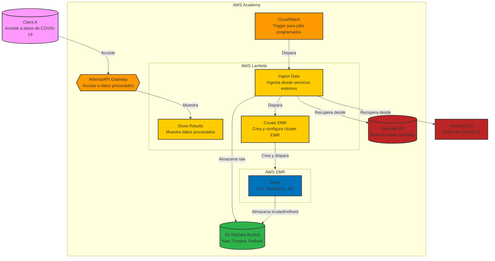

# Project 3 – Batch Architecture for Big Data (ST0263 - EAFIT)

## General Description
This project implements a big data example that automates the complete process of capturing, ingesting, processing, and outputting actionable data using AWS services.

## Architecture




## Tasks
### Inicial Setup
- [ ] Create S3 bucket: Zoned (Raw, Trusted and Refined)

### Capture and Ingestion
- [ ] Develop script to download data from URL/files about COVID-19
- [ ] Implement relational database (MySQL/PostgreSQL in RDS)
- [ ] Create script to extract data from the relational database
- [ ] Automate ingestion to S3 Raw using Lambda and EventBridge
- [ ] Implement duplicate check in the Raw zone

### ETL Processing
- [ ] Develop PySpark scripts for data cleaning and joining
- [ ] Automate EMR cluster creation (CLI/CloudFormation)
- [ ] Configure EMR Steps for automatic ETL execution
- [ ] Define storage structure in S3 Trusted

### Advanced Analytics
- [ ] Implement descriptive analysis scripts with SparkSQL
- [ ] Develop ML pipeline with SparkML
- [ ] Configure EMR Steps for analysis and storage in S3 Refined
- [ ] Define dependencies between ETL Steps and analytics

### Visualization and Access
- [ ] Configure AWS Athena for queries on S3 Refined
- [ ] Create API Gateway with Lambda backend for programmatic access
- [ ] Implement test client for the API

### Orchestration and Automation
- [ ] Integrate complete flow with AWS Step Functions
- [ ] Schedule periodic executions using EventBridge
- [ ] Configure alerts and monitoring with CloudWatch
- [ ] Create monitoring dashboard in AWS
---

## Setup

### :floppy_disk: Bucket S3

Create a bucket in S3 with the name you want `YOUR_BUCKET_NAME` and the following structure

1. Go to the S3 console.
2. Click on "Create bucket".
3. Enter the bucket name `YOUR_BUCKET_NAME`.
4. Choose the region (e.g., `us-east-1`).
5. Uncheck "Block all public access".
6. Click on "Create bucket".
7. Select the bucket you just created.
8. Click on "Permissions" tab.
9. On the "Bucket policy" section, click on "Edit".
10. Paste the following policy, replacing `YOUR_BUCKET_NAME` with your bucket name:

```json
{
	"Version": "2012-10-17",
	"Statement": [
		{
			"Sid": "AllowAllLambdaPutObject",
			"Effect": "Allow",
			"Principal": "*",
			"Action": "s3:PutObject",
			"Resource": "arn:aws:s3:::YOUR_BUCKET_NAME/*"
		},
		{
			"Sid": "AllowDeleteObjects",
			"Effect": "Allow",
			"Principal": "*",
			"Action": [
				"s3:DeleteObject",
				"s3:AbortMultipartUpload"
			],
			"Resource": "arn:aws:s3:::YOUR_BUCKET_NAME/*"
		},
		{
			"Sid": "AllowPublicRead",
			"Effect": "Allow",
			"Principal": "*",
			"Action": "s3:GetObject",
			"Resource": "arn:aws:s3:::YOUR_BUCKET_NAME/*"
		},
		{
			"Sid": "AllowListBucket",
			"Effect": "Allow",
			"Principal": "*",
			"Action": "s3:ListBucket",
			"Resource": "arn:aws:s3:::YOUR_BUCKET_NAME"
		}
	]
}
```

With this, your S3 bucket will have public access and your lambda function will be able to upload files to it.

### RDS (Relational Database Service)

1. Create the RDS instance with PostgreSQL.
2. Create a database named `covid_data`.
3. Import the CSV file into the database at [`country_data.csv`](./data/country_data.csv).

### Ingestion Lambda Function

1. Create a Lambda function with the following configuration:
   - Runtime: Python 3.12.0
   - Role: LabRole.
   - Copy the content of the [`data_insertion.py`](./scripts/data_insertion.py) file into the Lambda function.
   - Modify the `BUCKET_NAME`, `COVID_RAW_PREFIX` and `EMR_LAMBDA_NAME` values as your bucket name and the name of the EMR Lambda function you will create later.
2. Set up the layer with the following configuration:
   - Runtime: Python 3.12.0
   - Layer name: `ingestion_layer`
   - Upload the zip file from [`ingestion_layer.zip`](./layers/ingestion_layer.zip) to the layer.
3. Add the layer to the Lambda function.
4. Deploy the Lambda function.

### CloudWatch EventBridge

1. Go to the Amazon EventBridge console.
2. Click on the "Programmatic access" tab.
3. Click on "Create programmatic access".
  - Select "Recurring schedule".
  - Set the range to 1 hour.
  - Select the lambda function you created in the previous step.
  - Use the labrole role.
4. Click on "Create rule".

### EMR Creation Function

1. Create a Lambda function with the following configuration:
   - Runtime: Python 3.12.0
   - Role: LabRole.
   - Copy the content of the [`emr_creation.py`](./scripts/emr_creation.py) file into the Lambda function.
   - Modify the `bucket_name` for the respective bucket name of your AWS account.
   - Modify the json value for `ServiceRole` and `AutoScalingRole` matching the IAM roles you created of your account.

### EMR Steps

1. Create a folder in the S3 bucket with the name `scripts`.
2. Upload the following files to the `scripts` folder:
   - [`emr_steps.py`](./scripts/emr_steps.py)

---

## Authors
**Nombres:** 
	- Juan Felipe Restrepo Buitrago
	- Kevin Quiroz González
	- Julian Estiven Valencia Bolaños
	- Julian Agudelo Cifuentes
**Curso:** ST0263 - Tópicos Especiales en Telemática  
**Universidad:** EAFIT  
**Periodo:** 2025-1